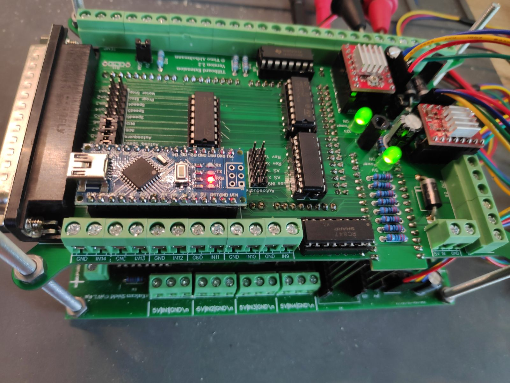

# README

## What is the Tillboard Extension?

An extension for the  [MPCNC-Nano-Estlcam-Shield](https://github.com/tnn85/MPCNC-Nano-Estlcam-Shield) build by Till Nenz. It is also called **Tillboard**

. Damit kann eine CNC Fräse mit der Software [Estlcam ](https://www.estlcam.de/)gesteuert werden. Die hier vorgestellte Erweiterung bzw. **Tillboard Extension** wird auf das Tillboard aufgesteckt und bringt einige neue Funktionalitäten mit sich. Die Tillboard Extension wurde zwar für die MPCNC designed, funktioniert aber genauso gut auf anderen Fräsen. Mit der Extension ist es außerdem möglich Autosqauring der Achsen trotz Nutzung von Estlcam auszuführen.

## Was für neue Funktionen bringt die Extension?

Die Extension tauscht für die Steuerung der CNC den Arduino Nano gegen einen Arduino Mega aus. Außerdem ist eine neue Schnittstelle hinzugekommen, mit der ein externes Bedienpanel nach eigenen Wünschen erstellt und angeklemmt werden kann.

Hier eine Auflistung der Funktionen:

* Alle Funktionen des Tillboards sind erhalten geblieben.
* Autosquaring der Achsen ist nun möglich.
* Zwei weitere Stepper Treiber können verbaut werden. Steuerung über externe Treiber ebenfalls möglich.
* Insgesamt 16 Eingänge und 8 Ausgänge, alle galvanisch getrennt.
* Alle in Estlcam konfigurierbaren Bedienelemente können genutzt werden, besonders hervorzuheben:
  * Verfahren per Joystick
  * Spindel Geschwindigkeit und Vorschub Einstellung per Poti
  * Programme / Motor starten und stoppen
* Display zur Anzeige des Autosquaring Status der Achsen und Temperatur der Fühler\(Können z.B. in Schaltkasten oder im Kühlmittel Tank positioniert werden\)
* Herausgabe aller Bedienelemente über eine SubD 37 Schnittstelle.

