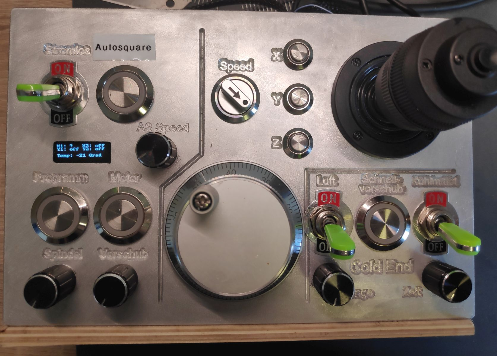
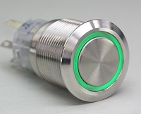
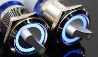
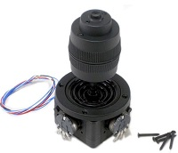
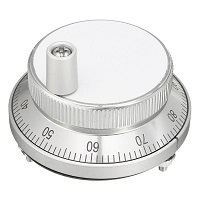
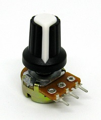
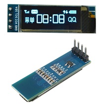
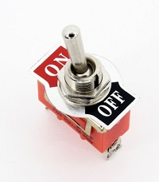

# Getting Started

## Bauteile / Requirements

Hier ist eine Auflistung der Ein-/Ausgänge, welche die Platine im Standard unterstützt und meiner Empfehlung welches Bauteil man dafür braucht. Weiter unten gibt es dann eine Übersicht der Bauteile.

| Funktion | Bauteil |
| :--- | :--- |
| Motor start | Taster |
| Motor stopp | Taster \(Wird aber nicht benötigt, da man auch einfach nochmal Start drücken kann\) |
| Programm start | Taster |
| Programm stop | Taster \(Wird aber nicht benötigt, da man auch einfach nochmal Start drücken kann\) |
| OK\(Abnullen\) | Taster \(Kann weg gelassen werden, wenn man einen 4-Axis Joystick hat und den knopf des Joysticks dafür nutzt\) |
| Stufe 1-6 | Drehschalter für 6 Positionen \(Ich habe nur einen für 3 Positionen verbaut - reicht für mich vollkommen\) |
| Auswahl X, Y, Z | Jeweils einen Taster. Hier ist es sinnvoll einen Taster mit LED zu nutzen, da die LED Anzeigt, welche Achse gerade verfahren wird, bzw. ausgewählt ist. |
| Joystick | 3- oder 4-Axis Analog Joystick \(Bei 4-Axis kann der Button zum OK/Abnullen genutzt werden\) |
| Handrad | Handrad mit 4 Anschlüssen\(A, B, VCC, GND\). Finde ich überflüssig, wenn schon der Joystick verbaut wird. |
| Spindel Geschwindigkeit | Potentiometer mit 5-10K Ohm |
| Vorschub Geschwindigkeit | Potentiometer mit 5-10K Ohm |
| Autosquaring | Taster, zum Starten von Autosquaring |
| Autosquaring Speed | Potentiometer mit 5-10K Ohm |
| Stromlos schalten | Schalter |
| Display | 4-Zeilen OLED Display |

Neben den Komponenten für die Panel Platine und der Panel Platine selbst kann ich folgende Sachen empfehlen\(Falls Du mich unterstützen willst kannst du die Affiliate Links nutzen, ansonsten kann man die Bauteile natürlich auch selbst über Suchmaschinen finden\):

<table>
  <thead>
    <tr>
      <th style="text-align:left">Bauteil</th>
      <th style="text-align:left">Beschreibung</th>
      <th style="text-align:left">Store Link</th>
    </tr>
  </thead>
  <tbody>
    <tr>
      <td style="text-align:left">
        
Taster

        

          
        

      </td>
      <td style="text-align:left">Gibts in verschiedenen Ausf&#xFC;hrungen. Genrell k&#xF6;nnen welche mit
        oder ohne LED genommen werden. Es gibt sie auch in vielen verschiedenen
        Durchmessern. Ich habe gute Erfahrung mit dem Durchmesser 22mm gemacht.
        M&#xF6;chte man kleinere sollten die aber einen erh&#xF6;hten Kopf haben,
        ansonsten braucht man sehr sehr kleine Finger um die vern&#xFC;nftig zu
        bet&#xE4;tigen. LED Taster k&#xF6;nnen entweder mit oder ohne Vorwiderstand
        genutzt werden. Also bis 5V kann man sich Taster mit LEDs aussuchen.</td>
      <td
      style="text-align:left"><a href="https://amzn.to/2wyopHt">Amazon</a>
         <a href="http://rover.ebay.com/rover/1/707-53477-19255-0/1?ff3=4&amp;pub=5575576561&amp;toolid=10001&amp;campid=5338665749&amp;customid=&amp;mpre=https%3A%2F%2Fwww.ebay.de%2Fitm%2FSchalter-Taster-beleuchtet-LED-16-19-22mm-Klingel-Druckschalter-Klingeltaster%2F311618190726%3F_trkparms%3Dispr%253D1%26hash%3Ditem488de43d86%3Am%3Am_A8rk6yWEWQO9lL4XBHr-g%26enc%3DAQAEAAACUBPxNw%252BVj6nta7CKEs3N0qXGBKxoyUlyl9wldGRYUmSslFgUNgzk5kEbyqmgR0KEM5KcchTaDnqcbV7ibmbxCq%252B%252Bo7ED4CDceqR58uDOA4fztMJtnsmKMaQd8zn8YJ1Vh27gRT%252FCQgcUXFo0x1oZaH%252Bsa18Hy0Kxa2I5JOuawabl5mPbL0HbLazmCa5eN1hQc60VCfkihg97PFvz1moRdX6iFCZ86rSyrL3IZV0wpQ%252Fux8SiwbBZ2p1juGRJ6%252B56qI4FoSkTdJc8X5T7muY%252FU4zEWsMq%252BJW%252BoiYWDBg1BK%252BuZZE0CmcfVqrsqJAeRAbnqPwypViaf8OPCVKiD7XZlXRDl6xFFe3lSxI5GJmCye4dLhb7pQLSHNXziJvRJs5ZTMMYj0W%252BBSStWw%252BgMdj7nVBrD3N%252FBvOSGwuR8HlSSS5W81BhBf9FOmJyjVEfaAWCwrfQUtHch78yr2YrK91AFa9IN7BOKp8CIll4g4CR%252BCGSns4tDdgGWcGAagwn2Th7EoXs2NDQnfFUDAkJgDzeuxhg5iCWxutQag8tp39w3K4SnL9XTy2IkQliQj5%252BA1FFzowyqfx6%252FYdUojHRXtmGEn8mnb8utfMSu1vRraavbJ32sbhuod9nOTRZoc77rm4hM5C8NVvjAEFQfFSwrR%252BmrIEqYEKU5Y6Fnd60%252F1n2qNgcJVQ1SV0MSNpXXga35G3qpFaFJ8O2HoHtOYXz7Pf7K7kLq%252BwFqcEeKv%252BXo5xt8c5ZQmoRLZlN3YxFAXLd6m8yEwcz6e7SqiZBKvOvZBj8WKY%253D%26checksum%3D31161819072634d3723e04f945f4895b15cbd478fcd5">Ebay</a>
        </td>
    </tr>
    <tr>
      <td style="text-align:left">
        
Drehschalter

        

          
        

      </td>
      <td style="text-align:left">Ich w&#xFC;rde f&#xFC;r die Geschwindigkeitseinstellung einen mit 3 Positionen
        nehmen. Das sollte reichen. Mit ein wenig beleuchtung wird nat&#xFC;rlich
        h&#xFC;bscher.</td>
      <td style="text-align:left"></td>
    </tr>
    <tr>
      <td style="text-align:left">
        
Joystick

        

          
        

      </td>
      <td style="text-align:left">Ich habe einen 4 Axis Joystick mit 10K Ohm, 5K Ohm sollten auch aber funktionieren.</td>
      <td
      style="text-align:left"><a href="http://rover.ebay.com/rover/1/707-53477-19255-0/1?ff3=4&amp;pub=5575576561&amp;toolid=10001&amp;campid=5338665749&amp;customid=&amp;mpre=https%3A%2F%2Fwww.ebay.de%2Fsch%2Fi.html%3F_osacat%3D58168%26_odkw%3Ddrehschalter%2B3%2Bled%26_from%3DR40%26_trksid%3Dm570.l1313%26_nkw%3D4%2Baxis%2Bjoystick%26_sacat%3D0">Ebay</a>
        </td>
    </tr>
    <tr>
      <td style="text-align:left">
        
Handrad

        

          
        

      </td>
      <td style="text-align:left">Das gibts in mit verschiedenen Durchmessern. Ich besitze die 60mm Variante.
        Wichtig ist, dass es 4-polig ist-</td>
      <td style="text-align:left">
        
<a href="http://rover.ebay.com/rover/1/707-53477-19255-0/1?ff3=4&amp;pub=5575576561&amp;toolid=10001&amp;campid=5338665749&amp;customid=&amp;mpre=https%3A%2F%2Fwww.ebay.de%2Fsch%2Fi.html%3F_osacat%3D0%26_odkw%3Dhandrad%26_from%3DR40%26_trksid%3Dp2334524.m570.l1313.TR12.TRC2.A0.H0.Xhandrad%2Bcnc.TRS0%26_nkw%3Dhandrad%2Bcnc%26_sacat%3D0">Ebay</a>
        

        
<a href="https://amzn.to/39t1zy1">Amazon</a>
        

      </td>
    </tr>
    <tr>
      <td style="text-align:left">
        
Potentiometer

        

          
        

      </td>
      <td style="text-align:left">F&#xFC;r die Analogen Einstellungen. Es sollten welche mit 5-10K Ohm genutzt
        werden.</td>
      <td style="text-align:left">
        
<a href="http://rover.ebay.com/rover/1/707-53477-19255-0/1?ff3=4&amp;pub=5575576561&amp;toolid=10001&amp;campid=5338665749&amp;customid=&amp;mpre=https%3A%2F%2Fwww.ebay.de%2Fsch%2Fi.html%3F_odkw%3Dpit%2B10k%26_osacat%3D0%26_from%3DR40%26_trksid%3Dm570.l1313%26_nkw%3Dpoti%2B10k%26_sacat%3D0">Ebay</a>
        

        
<a href="https://amzn.to/2QOFNym">Amazon</a>
        

      </td>
    </tr>
    <tr>
      <td style="text-align:left">
        
Display

        

          
        

      </td>
      <td style="text-align:left">Ich nutze ein 4 Zeilen OLED Display mit 0.91 Zoll und 128x32 Pixel. Wenn
        ein anderes genutzt werden soll muss der Arduino Code angepasst werden.</td>
      <td
      style="text-align:left">
        
<a href="http://rover.ebay.com/rover/1/707-53477-19255-0/1?ff3=4&amp;pub=5575576561&amp;toolid=10001&amp;campid=5338665749&amp;customid=&amp;mpre=https%3A%2F%2Fwww.ebay.de%2Fsch%2Fi.html%3F_osacat%3D0%26_odkw%3Doled%2Bi2c%26_from%3DR40%26_trksid%3Dp2334524.m570.l1313.TR1.TRC0.A0.H0.Xoled%2B0.91.TRS0%26_nkw%3Doled%2B0.91%26_sacat%3D0">Ebay</a>
        

        
<a href="https://amzn.to/2y6lh5N">Amazon</a>
        

        </td>
    </tr>
    <tr>
      <td style="text-align:left">
        
Schalter

        

          
        

      </td>
      <td style="text-align:left">Hier hat man im Grunde die freie Wahl.</td>
      <td style="text-align:left">
        
<a href="http://rover.ebay.com/rover/1/707-53477-19255-0/1?ff3=4&amp;pub=5575576561&amp;toolid=10001&amp;campid=5338665749&amp;customid=&amp;mpre=https%3A%2F%2Fwww.ebay.de%2Fsch%2Fi.html%3F_osacat%3D0%26_odkw%3Doled%2B0.91%26_from%3DR40%26_trksid%3Dp2334524.m570.l1313.TR12.TRC2.A0.H0.X12v%2Bschalte.TRS0%26_nkw%3D12v%2Bschalter%26_sacat%3D0">Ebay</a>
        

        
<a href="https://amzn.to/3bxkqK2">Amazon</a>
        

      </td>
    </tr>
  </tbody>
</table>