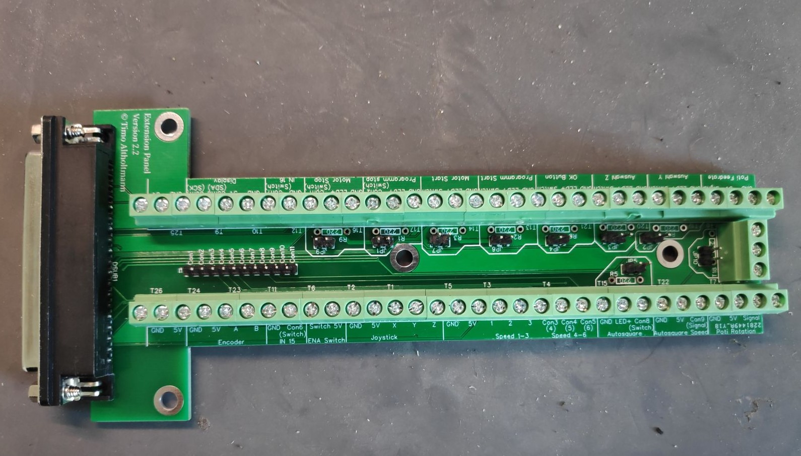

# Platine

## Beschreibung

### Jumper / Terminals

<table>
  <thead>
    <tr>
      <th style="text-align:left">Beschriftung</th>
      <th style="text-align:left">Funktion</th>
      <th style="text-align:left">Beschreibung</th>
    </tr>
  </thead>
  <tbody>
    <tr>
      <td style="text-align:left">JP1-7</td>
      <td style="text-align:left">Stromversorgung der LEDs</td>
      <td style="text-align:left">
        
Ist der Jumper gesetzt wird die LED am n&#xE4;chstliegenden Terminal mit
          5V versorgt.

        
Ohne Jumper wird die LED mit 5V + anliegendem Vorwiderstand versorgt.

      </td>
    </tr>
  </tbody>
</table>## Zusammenbau / Löten

Hier gibts glaube ich nicht all Zuviel zu sagen.

### Bilderstrecke

|  |  |
| :--- | :--- |
|   |   |

