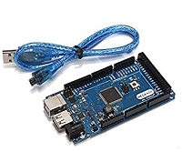
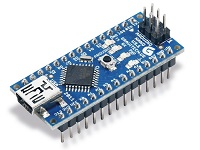
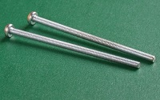
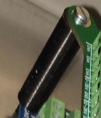

# Getting Started

## Bauteile / Requirements 

Neben den Komponenten für die Extension Platine und der Extension Platine selbst werden folgende Sachen benötigt\(Falls Du mich unterstützen willst, kannst Du die Affiliate Links nutzen, ansonsten kann man die Bauteile natürlich auch selbst über Suchmaschinen finden\):

<table>
  <thead>
    <tr>
      <th style="text-align:left">Bauteil</th>
      <th style="text-align:left">Beschreibung</th>
      <th style="text-align:left">Links</th>
    </tr>
  </thead>
  <tbody>
    <tr>
      <td style="text-align:left">
        
Arduino Mega

        

          
        

      </td>
      <td style="text-align:left">Steuerung der Fr&#xE4;se</td>
      <td style="text-align:left">
        
&#x200B;<a href="https://amzn.to/2UIr4pQ">Amazon</a>&#x200B;

        
&#x200B;<a href="http://rover.ebay.com/rover/1/707-53477-19255-0/1?ff3=4&amp;pub=5575576561&amp;toolid=10001&amp;campid=5338665749&amp;customid=&amp;mpre=https%3A%2F%2Fwww.ebay.de%2Fsch%2Fi.html%3F_from%3DR40%26_trksid%3Dp2380057.m570.l1313.TR12.TRC2.A0.H0.Xarduino%2Bmega.TRS0%26_nkw%3Darduino%2Bmega%26_sacat%3D0">Ebay</a>&#x200B;

      </td>
    </tr>
    <tr>
      <td style="text-align:left">
        
Arduino Nano

        

          
        

      </td>
      <td style="text-align:left">Steuerung Autosquaring, wenn man schon das Tillboard hat, kann nat&#xFC;rtlich
        der vorhandene Arduino Nano genutzt werden</td>
      <td style="text-align:left">
        
&#x200B;<a href="https://amzn.to/33UyXgi">Amazon</a>&#x200B;

        
&#x200B;<a href="http://rover.ebay.com/rover/1/707-53477-19255-0/1?ff3=4&amp;pub=5575576561&amp;toolid=10001&amp;campid=5338665749&amp;customid=&amp;mpre=https%3A%2F%2Fwww.ebay.de%2Fsch%2Fi.html%3F_osacat%3D0%26_odkw%3Darduino%2Bmega%26_from%3DR40%26_trksid%3Dp2334524.m570.l1313.TR11.TRC1.A0.H0.Xarduino%2Bnano.TRS0%26_nkw%3Darduino%2Bnano%26_sacat%3D0">Ebay</a>&#x200B;

      </td>
    </tr>
    <tr>
      <td style="text-align:left">
        
Schrauben (4 St&#xFC;ck)

        
M3x60 oder M4x60

        

          
        

      </td>
      <td style="text-align:left">Befestigung der Extension &#xFC;ber dem Tillboard. Je nachdem, wie das
        Tillboard befestigt ist, kann man sich auch andere L&#xF6;sungen einfallen
        lassen. L&#xE4;nger geht auch(kann man ja sp&#xE4;ter passend eink&#xFC;rzen)</td>
      <td
      style="text-align:left">
        
&#x200B;<a href="https://amzn.to/39pXScG">Amazon_M3</a>&#x200B;

        
&#x200B;<a href="https://amzn.to/2UmoEhG">Amazon_M4</a>&#x200B;

        
&#x200B;<a href="http://rover.ebay.com/rover/1/707-53477-19255-0/1?ff3=4&amp;pub=5575576561&amp;toolid=10001&amp;campid=5338665749&amp;customid=&amp;mpre=https%3A%2F%2Fwww.ebay.de%2Fitm%2FM-3-DIN-84-verzinkte-Zylinderschrauben-Zylinderkopfschrauben-mit-Schlitz-M3x%2F371713576275%3F_trkparms%3Dispr%253D1%26hash%3Ditem568bdb0d53%3Am%3Am770E7vulaEbVBWrbWkLJrA%26enc%3DAQAEAAACQBPxNw%252BVj6nta7CKEs3N0qUOgmGNFJW4%252FH7s9MVTsxB0d20uhoqtMJNnZyg9WFsRlJCy7g3nAaWoG5POAQPWF7%252BfFLzza7o4vedvr6UgoXbgczXseYY75GzxM02IaTRlMB%252FXbLa1SIC%252FJY4qL154dG81LwJ5ITiLrvzfmYIl7xX3p59321mpsTCu4fQBy6NkSNGoWFcoMYrdb94CDD5v5zqqd81qNuZb%252BLtrajKfSN0dGT544uuyl59bWGa8S6bP%252Fi3UonUMpTUYuEs6dufUY8biYUYGwTC%252FGBTmw%252FRccAOzroUrE0uXLDm4OayC8K7UEzJSYEdhroS83PCP9sOyIEXU3eOsfefUz6zHF%252F%252FG4JctwIr%252FqDr2JJBSsXFvMlXFgXwiTvSmHCHykFOIvubUwA1r7Uq%252BFl5lunom26YQbaWCg5uSKNv2ejwrR9Pq4Mvlo4aL6od5j%252B1lNRPvif4HeL79nKbnz8ife2TLf%252Fo%252BWUAgNDhCOp8si6X9VWHUNKacB6pMtWrPkEg5ZRV0HPvvsFcvIMxbjLFVsRNiheEVOPOBxVqtXIQFKbd0oSJViIoBMaxnpZtpppT8cvHtHZQl%252FfTnWzlpyKvl5vGcsQPse2UE%252FgSW1of97u1pgMYM7qpCKKkw2cCpCv4Z06MmHOSkZW7pWHtUdRWHxI0Kg7fXHD%252Bo5nQ4eRsHv6aO1m6FAOR1th%252FNk9oUs02tukgPeZmMRLRYfs1uJvPkMcrLy7nO6D8QBeYmHDnz4sM6NF6zrv5uhQ%253D%253D%26checksum%3D3717135762755a302fb8caa2459aa014c38c40d8c158">Ebay_M3</a>&#x200B;

        
&#x200B;<a href="http://rover.ebay.com/rover/1/707-53477-19255-0/1?ff3=4&amp;pub=5575576561&amp;toolid=10001&amp;campid=5338665749&amp;customid=&amp;mpre=https%3A%2F%2Fwww.ebay.de%2Fitm%2FM4-DIN-7985-A2-Edelstahl-Linsenschrauben-Linsenkopfschrauben-Kreuzschlitz-H-M4x%2F371713578736%3Fepid%3D1680797934%26_trkparms%3Dispr%253D1%26hash%3Ditem568bdb16f0%3Am%3AmQd29PXrny4Fpdowbip3Y5w%26enc%3DAQAEAAACQBPxNw%252BVj6nta7CKEs3N0qUucilHqCb3zjtYcm3TyiRyoRU7GI8%252Bqs4N8NXmO%252BhkBSnSuvBXmuEouOWihERrR%252Bbrp2PgdRPIxsLd%252Fr5MWaMbvlnSAfDcVPoFWJMdmbc1AVfFu7MqUXDHS2uodqm5OKhuHryFoBSkCmkg6CYj3nTLsnFHvq3gN0zTAPRHOSkrK7A3tARYV4mrxzASA1iDRHuFb3s9nF7hws5Xge6uJamf%252FecaW%252BJISBSRW%252Biu4EQUqKzkPO%252BecSmUro05NLDY5IwTqbPmtWSvjiwf3Uqnih4DcQbpYzkQ3BlUtHK4B8BWa%252FWnbF%252BJtSMfs%252BG0b2v%252FbNt4vnci5IMrZPCPRHDcAGlU%252BJaUv%252FmfBQvNc3HdqtVggt6DQv75M7Lauu7U6qYg3RoP1uG4PrtNe9eHaxLmiAfN7W2sjlee%252FnIgpUsbO0%252Fr6ehrvzos5OKlwB%252B4Bp70luIWz0wJE8JIbYAub%252BhzducX4AOZVenkDiOaFpJAA029tsvOSDKupKyvUhK95x%252FSsrNqaZOLoZbR3rcAg6D%252FT7FCS4ByrOqKcpbnQygsc9sdN9%252FqJ%252FVYpLSeWbpEAS6sghdKlYJK0VLPWSdxkE8cbHYldX2Ii4WUWV46sTUgci%252B1qJGKMLdkJZlU89X1sYYiM3Ctz3a06LqAEhueQK2gIpCM3VrCpnxYQbz8mCsz5qTaVH7F9r3rMdsoygjM6WufjWLnbJETVJKtwLPaoA2ZtnrWuRxH3eldn3qR2SFDjETnSA%253D%253D%26checksum%3D371713578736b11c9afa9ac946ba9ab9acd25181f4d5">Ebay_M4</a>&#x200B;

        </td>
    </tr>
    <tr>
      <td style="text-align:left">
        
Abstandshalter (4 St&#xFC;ck)

        

          
        

      </td>
      <td style="text-align:left">Zwischen den Boards. Ich habe mir die einfach selbst im 3D Drucker gedruckt.
        Geht ganz fix. Durchmesser passend zur Schraube und die L&#xE4;nge je nachdem,
        welche Spacer genutzt werden.</td>
      <td style="text-align:left"></td>
    </tr>
  </tbody>
</table>

\`\`

