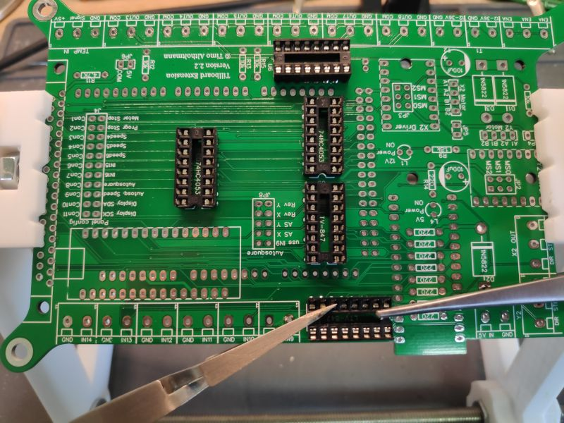
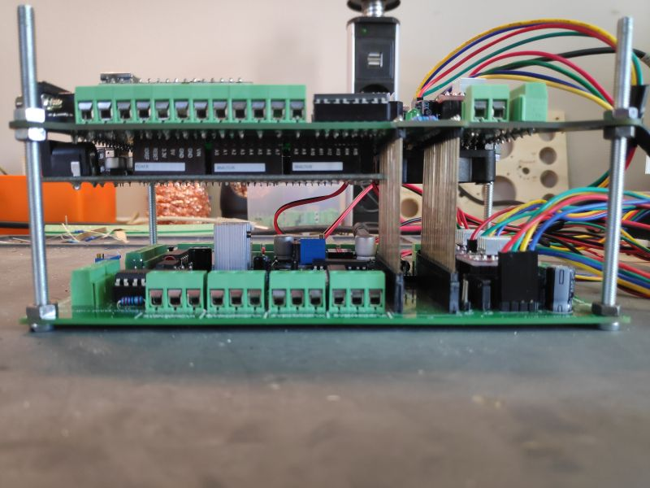

# Platine

Das wichtigste Vorweg: Das Ganze ist ein Hobby von mir und ich bin kein ausgebildeter Elektriker. Daher übernehme ich auch keinerlei Haftung für eventuelle Schäden die durch die Extension indirekt oder direkt entstehen. Wer sich das Löten nicht zutraut, sucht sich Hilfe bei bekannten oder in einem Elektronikfachgeschäft.

## Beschreibung

### Jumper / Terminals

<table>
  <thead>
    <tr>
      <th style="text-align:left">Beschriftung</th>
      <th style="text-align:left">Funktion</th>
      <th style="text-align:left">Beschreibung</th>
    </tr>
  </thead>
  <tbody>
    <tr>
      <td style="text-align:left">JP2 / JP3</td>
      <td style="text-align:left">Microstepping</td>
      <td style="text-align:left">Microstepping Einstellung der Treiber. <b>Unbedingt die gleiche Microstepping Einstellung f&#xFC;r beide Motoren einer Achse nutzen</b>.</td>
    </tr>
    <tr>
      <td style="text-align:left">JP4 / JP5</td>
      <td style="text-align:left">Fault / Treiber</td>
      <td style="text-align:left">
        
Fault Jumper beim DRV8825 Treiber.

        
<b>Muss beim A4988 gesetzt sein.</b>
        

      </td>
    </tr>
    <tr>
      <td style="text-align:left">JP6</td>
      <td style="text-align:left">OUT Voltage</td>
      <td style="text-align:left">
        
Dieser jumper muss gesetzt sein, wenn an den COM Ports der Ausg&#xE4;nge
          5V anliegen soll.

        
Ansonsten diesen jumper frei lassen und selbst Power auf einen COM Anschluss
          geben.

        
Gilt nur f&#xFC;r die Ausg&#xE4;nge auf der Extension Platine. Das Tillboard
          hat einen eigenen Jumper &#xFC;ber den OUT1 und OUT2 eingestellt werden.

        
OUT3 vom Tillboard ist kein richtiges OUT3 - das ist das Einschalt-Signal
          f&#xFC;r die Fr&#xE4;se. Wenn also OUT3 von der Estlcam Software aus verwendet
          werden soll, muss der OUT3 der Extension Platine verwendet werden.

      </td>
    </tr>
    <tr>
      <td style="text-align:left">JP8</td>
      <td style="text-align:left">Autosquare config</td>
      <td style="text-align:left">
        
<b>use IN9</b>: Wenn gesetzt wird IN9 w&#xE4;hrend des Autosquaring ausgel&#xF6;st.
          Kann man dann z.B. in Estlcam als Endstopp setzen, damit Estlcam wei&#xDF;,
          dass er gerade nicht verfahren kann.

        
<b>AS X</b>: muss gesetzt sein, wenn autosquare X an ist.

        
<b>AS Y</b>: muss gesetzt sein, wenn autosquare Y an ist.

        
<b>Rev X</b>: Auto Squaring der x-Achse in die andere Richtung.
           <b>Rev Y</b>: Auto Squaring der y-Achse in die andere Richtung.

      </td>
    </tr>
    <tr>
      <td style="text-align:left">
        
J4
           
        

        

          
        

      </td>
      <td style="text-align:left">Panelanschluss Konfiguration</td>
      <td style="text-align:left">
        
Con1 - Con11 k&#xF6;nnen frei belegt werden und stehen an der Platine
          f&#xFC;rs Panel wieder zur Verf&#xFC;gung.

        
Die nebenstehenden Pins sind Funktionen, die nicht standardm&#xE4;&#xDF;ig
          am Panel verf&#xFC;gbar sind.

        
M&#xF6;chte man diese Funktion jedoch dennoch am Panel haben kann man
          hier einfach einen Jumper setzen und Con1 wird dann mit &#x201C;Motor Stop&#x201D;
          belegt. Dies gilt ebenso f&#xFC;r die anderen Pins.

        
Man kann allerdings auch komplett andere Sachen an die freien Pins anlegen,
          z.B. die Steuerung f&#xFC;r das ColdEnd oder &#xE4;hnliches.

        
<b>Motor/Programm Stop</b>: Das Gegenst&#xFC;ck zu Motor/Programm Start.
          Kann weggelassen werden, da man auch einfach zweimal Start dr&#xFC;cken
          kann.

        
<b>Speed 4-6</b>: F&#xFC;r mich haben drei Geschwindigkeitseinstellungen
          vollkommen ausgereicht. Diese k&#xF6;nnen in Estlcam unter Steuerung-&gt;
          Bedienelemente frei konfiguriert werden. Braucht man mehr, kann man hier
          die Jumper setzen.

        
<b>IN15 / IN16</b>: Eingang 15 und 16. Falls man am Panel noch einen Eingang
          belegen m&#xF6;chte(Tastplatte?)
           <b>Autosquare</b>: Startet das Auto Squaring.

        
<b>Autosquare Speed</b>: Poti f&#xFC;r die Geschwindigkeitseinstellung
          vom Autosquaring. Je nachdem wie die Microstepps eingestellt sind variiert
          diese bei jeder Fr&#xE4;se. Daher kann man die entweder hier mit einem
          Poti einstellen, oder in dem Arduino Programm f&#xFC;r den Nano fest einstellen.

        
<b>Display SCK / SDA</b>: Anschl&#xFC;sse f&#xFC;r das OLED Display

      </td>
    </tr>
    <tr>
      <td style="text-align:left">T1 / T2</td>
      <td style="text-align:left">12V in/out</td>
      <td style="text-align:left">Hier das Netzteil anschlie&#xDF;en. Der zweite Terminal kann genutzt werden,
        um das Tillboard mit Strom zu versorgen.</td>
    </tr>
    <tr>
      <td style="text-align:left">T3</td>
      <td style="text-align:left">5V in</td>
      <td style="text-align:left">Optional. Als Sicherheit gedacht, falls der Transistor auf dem Tillboard
        &#xFC;berfordert ist. Kann erstmal frei gelassen werden.</td>
    </tr>
    <tr>
      <td style="text-align:left">X2 Motor / Y2 Motor</td>
      <td style="text-align:left">Motor Anschl&#xFC;sse</td>
      <td style="text-align:left">A1, A2, B1, B2 der Motoren. Falls der Motor falsch herum dreht einfach
        den Stecker einmal drehen.</td>
    </tr>
    <tr>
      <td style="text-align:left">X2 OUT / Y2 OUT</td>
      <td style="text-align:left">Treiber extern</td>
      <td style="text-align:left">Hier sind die STEP und DIR Signale f&#xFC;r die Verwendung mit externen
        Treibern.</td>
    </tr>
    <tr>
      <td style="text-align:left">IN9-14</td>
      <td style="text-align:left">Eing&#xE4;nge 9-14</td>
      <td style="text-align:left">Diese Eing&#xE4;nge werden gegen GND ausgel&#xF6;st. Also einfach einen
        Schalter zwischen IN und GND. Dann kann der Eingang entsprechend in Estlcam
        konfiguriert werden.</td>
    </tr>
    <tr>
      <td style="text-align:left">OUT3-8</td>
      <td style="text-align:left">Ausg&#xE4;nge 3-8</td>
      <td style="text-align:left">Bei den Ausg&#xE4;ngen wird ebenfalls gegen GND geschaltet. Also z.B.
        ein Relais an OUT3 und COM anklemmen. COM kann mit dem JP6 Jumper entweder
        auf 5v eingestellt werden oder man legt selbst ein Kabel an einem der COM
        Terminals. Man k&#xF6;nnte z.B. 12V vom Tillboard darunter nehmen.</td>
    </tr>
    <tr>
      <td style="text-align:left">ENA</td>
      <td style="text-align:left">Enable der Treiber</td>
      <td style="text-align:left">
        
Leider sind beim Tillboard die ENA Anschl&#xFC;sse fest auf GND gelegt.
          Daher bleibt nur die Beinchen der Treiber abzukneifen und dann den ENA
          der Treiber an den richtigen Terminal am Extension Board anzuschlie&#xDF;en.
          Generell werden alle ENA gleich geschaltet, daher ist es egal, ob man ENA1,
          ENA2 oder ENA3 nutzt.

        
Nutzt man externe Treiber, kann man einfach alle ENA der Treiber am Board
          an dem 3er Terminal anschlie&#xDF;en.

      </td>
    </tr>
  </tbody>
</table>### LEDs

| Beschriftung | Beschreibung |
| :--- | :--- |
| L1 | Zeigt an, ob 5V auf dem Board verfügbar ist |
| L4 | Zeigt an, ob 12V auf dem Board verfügbar ist |

## Zusammenbau / Löten

Zur Technik brauche ich vermutlich nicht mehr viel zu sagen, da Du bereits das Tillboard erfolgreich fertig gelötet hast. Der Aufwand ist bei dieser Platine ähnlich und das Vorgehen unterscheidet sich auch nicht großartig. Das wird hier keine "Schritt für Schritt" Anleitung.  

### Vorbereitung / Materialien

Hier mal eine kleine Auflistung der Sachen, die ich benutze, um Platinen zu löten:

<table>
  <thead>
    <tr>
      <th style="text-align:left">Bauteil</th>
      <th style="text-align:left">Beschreibung</th>
      <th style="text-align:left">Link</th>
    </tr>
  </thead>
  <tbody>
    <tr>
      <td style="text-align:left">
        
PCB Halterung

        

          
        

      </td>
      <td style="text-align:left">Kann man sich selbst aus dem 3D-Drucker ausdrucken. Hat sich absolut bew&#xE4;hrt.</td>
      <td
      style="text-align:left"><a href="https://www.thingiverse.com/thing:965574">Thingiverse</a>
        </td>
    </tr>
    <tr>
      <td style="text-align:left">
        
Pinzette

        

          
        

      </td>
      <td style="text-align:left">Meiner Meinung nach unverzichtbar. Hiermit k&#xF6;nnen die Bauteile sehr
        leicht an ihrer Stelle gehalten werden. Man fixiert das Bauteil und dreht
        dann die Platine um und kann das Bauteil einfach fest l&#xF6;ten. Gibt
        es in verschiedenen Ausf&#xFC;hrungen und L&#xE4;ngen.</td>
      <td style="text-align:left">
        
<a href="https://amzn.to/3bunjv1">Amazon</a>
        

        
<a href="http://rover.ebay.com/rover/1/707-53477-19255-0/1?ff3=4&amp;pub=5575576561&amp;toolid=10001&amp;campid=5338665749&amp;customid=&amp;mpre=https%3A%2F%2Fwww.ebay.de%2Fsch%2Fi.html%3F_osacat%3D0%26_odkw%3D12v%2Bschalter%26_from%3DR40%26_trksid%3Dp2334524.m570.l1313.TR4.TRC2.A0.H0.Xkreuzpinzette.TRS0%26_nkw%3Dkreuzpinzette%26_sacat%3D0">Ebay</a>
        

        
<a href="     https://s.click.aliexpress.com/e/_dX5dvu6">AliExpress</a>
        

      </td>
    </tr>
    <tr>
      <td style="text-align:left">
        
Entl&#xF6;tpumpe

        

      </td>
      <td style="text-align:left">Falls sich Pads verbinden oder zu viel L&#xF6;tzinn aufgetragen wurde.
        Mir reicht so ein billiges Exemplar bis 5 &#x20AC; vollkommen.</td>
      <td
      style="text-align:left">
        
<a href="http://rover.ebay.com/rover/1/707-53477-19255-0/1?ff3=4&amp;pub=5575576561&amp;toolid=10001&amp;campid=5338665749&amp;customid=&amp;mpre=https%3A%2F%2Fwww.ebay.de%2Fsch%2Fi.html%3F_osacat%3D0%26_odkw%3Dl%25C3%25B6tzinn%2Bpumpe%26_from%3DR40%26_trksid%3Dp2334524.m570.l1313.TR7.TRC2.A0.H0.Xentl%25C3%25B6tpumpe.TRS0%26_nkw%3Dentl%25C3%25B6tpumpe%26_sacat%3D0">Ebay</a>
        

        
<a href="https://amzn.to/2WONTLl">Amazon</a>
        

        
<a href="     https://s.click.aliexpress.com/e/_dYoVm26">AliExpress</a>
        

        </td>
    </tr>
    <tr>
      <td style="text-align:left">Seitenschneider / Kabelschneider</td>
      <td style="text-align:left">Die Funktion muss ich wohl nicht erkl&#xE4;ren :-)</td>
      <td style="text-align:left">
        
<a href="https://amzn.to/3dDokTc">Amazon</a>
        

        
<a href="     https://s.click.aliexpress.com/e/_dX5hzL0">AliExpress</a>
        

      </td>
    </tr>
    <tr>
      <td style="text-align:left">Ein k&#xFC;hles Pils Deiner Lieblingsmarke</td>
      <td style="text-align:left">Als Nervennahrung ;-)</td>
      <td style="text-align:left"></td>
    </tr>
  </tbody>
</table>### Informationen für den Zusammenbau

Damit man immer gut an die Bauteile ran kommt, kann ich nur empfehlen sich von den Niedrigsten zu den größten Bauteilen vorzuarbeiten. Es sollte vor allem darauf geachtet werden sauber zu löten und nur Lötzinn auf die dafür vorgesehenen Pads zu geben. Sollte einmal soviel Lötzinn an einem Pad sein, oder sollten sich zwei Pads verbinden kann man gut so eine kleine Vakuumspritze zum Entfernen des überflüssigen Zinns benutzen

### Bilderstrecke / Anleitung

|  |  |
| :--- | :--- |
|   |   |
|   | Beim Löten der IC-Sockel sollte unbedingt auf die richtige Richtung geachtet werden. Die Kerben sollten übereinander liegen, wie hier auf dem Bild zu sehen. |
|   | Die ICs werden ebenfalls so eingesteckt, dass die Kerben übereinander liegen. Manche ICs haben einen Punkt anstatt einer Kerbe. Dann muss halt der Punkt über der Kerbe des Sockels liegen |
|   |   |


Die Beinchen der Widerstände und LEDs noch nicht wegschmeißen. Die können für das Panel später noch verwendet werden.


|  |  |
| :--- | :--- |
|   | Der Male Header für den Arduino Mega werden auf die andere Seite gelötet. Der Arduino Mega ist damit quasi unter der Platine. |
|   |   |
|   | Die Board Spacer werden ebenfalls nach unten angebracht und werden später in die Anschlüsse für den Arduino Nano des Tillboards gesteckt. |
|   |   |
|   | Die Terminals können zusammen gesteckt werden und dann in eins angebracht werden. Daher ist es eigentlich auch egal, ob man die 3er oder 2er Terminals nutzt. Wenn viele ineinander gesteckt werden kann es sein, dass man die auf dem Board ein wenig drücken muss, damit die in die Löcher passen. |
|   |   |

|  |  |
| :--- | :--- |
|   |  Auf der Unterseite der Platine befindet sich noch ein 5V Anschluss für einen 40x40 mm Lüfter, den man dort optional installieren kann. Generell sollte der ganze Aufbau gut gekühlt werden. Der kleine Lüfter wird dafür nicht ausreichen. |

### Test

Nach dem ganzen Löten und zusammenbauen wollen wir die Platine erstmal testen, bevor wir Strom darauf geben. 


Zu diesem Zeitpunkt noch nicht den Arduino Nano einstecken! Dieser braucht vorher die richtige Firmware!


1. Dazu nehmen wir unser Messgerät und überprüfen einmal, ob wir irgendwo einen offensichtlichen "kurzen" haben, indem wir eine Durchgangsprüfung beim Terminal vom Temperatur Sensor machen. Also eine Leitung dort auf GND und die andere auf 5V. Hier sollte natürlich kein Durchgang sein.
2. Dann können wir einmal 5V auf das Board geben und schauen, ob die LED leuchtet. Das geht am besten an dem Terminal für 5V in.
3. Als Nächstes kann 12-36V angeschlossen werden. Die andere LED sollte aufleuchten.
4. Wenn bis hier hin nichts abgeraucht ist, kann die Platine aufs Tillboard aufgesteckt werden und mit dem zweiten 12-36V Terminal kann man auch das Tillboard mit Strom versorgen.

### Anschluss

|  |  |
| :--- | :--- |
|   | Ich habe die beiden Boards hier provisorisch mit Schrauben und Muttern befestigt. Allerdings wird man beim Einbau in den Schaltkasten eher eine lange Schraube mit Abstandshaltern benötigen. |


Immer noch nicht den Arduino Nano einstecken! Das machen wir im nächsten Kapitel


Wenn die LEDs nach dem Verbinden der Boards entsprechend Leuchten und alles gut aussieht kann man den Arduino Mega mit dem PC verbinden prüfen, ob auch mit Estlcam alles läuft. Hier muss in der Steuerung nun Arduino Mega aus der Liste ausgewählt werden.   
Hat man die Treiber ebenfalls angeschlossen kann man schon testen, ob alles richtig verfährt.

